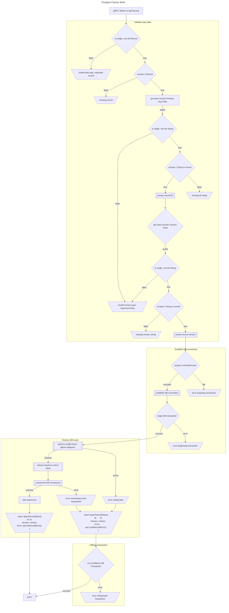

```mermaid
---
title: Postgres model.Insert
---

flowchart TD


    INPUT>"ctx context.Context, tx pgx.Tx, data *api.Data"]
    INPUT --> TX_NOT_NIL{"check tx param not nil"}
    INPUT --> DATA_NOT_NIL{"check data param not nil"}
    subgraph validate["validate input parameters"]

        TX_NOT_NIL --nil--> ZTX_NOT_NIL[/"panic(tx must not be nil)"/]


        DATA_NOT_NIL --nil--> ZDATA_NOT_NIL[/"panic(data must not be nil)"/]

        IS_RECORD_TYPE{"check data.Type is api.DataType_RECORD"}
        TX_NOT_NIL -- ok --> IS_RECORD_TYPE
        DATA_NOT_NIL -- ok --> IS_RECORD_TYPE

        IS_RECORD_TYPE --false--> MALFORMED_DATA[/"graph.MalformedDataError()"/]
        IS_RECORD_TYPE --true--> IS_LIST{"check data.Record is a list"}

        IS_LIST --true--> RECURSION_LOOP(["loop data.Records"])

        subgraph recursion_loop
            RECURSION_LOOP --> EXEC_INSERT(["execute model.Insert"])
            EXEC_INSERT --error--> RECURSION_ERROR[/"returns the error occurred"/]
            EXEC_INSERT --success--> APPEND_SEQ(["append returned sequence state to seq state slice"])
            APPEND_SEQ --records remaining--> RECURSION_LOOP
            APPEND_SEQ --no records remaining--> RECURSION_RET[/"return sequence state slice"/]
        end

    end

    subgraph prep["prepare args and determine child key for future use"]
        IS_LIST --false--> COL_LOOP

        COL_LOOP(["loop model.columns"]) --each--> CHECK_FIELDS(["extract input data record's Data for the iteration's column"])

        CHECK_FIELDS --true--> DECODE(["extract value of Data field using iteration column's Decode function"])
        DECODE --error--> ZDECDOE[/"invalid value for iteration's column name"/]

        DECODE --success--> CHECK_KEY_IDX{"check current iteration is model's keyIdx"}
        CHECK_KEY_IDX --true --> SET_KEY_VALUE(["set decoded value of Data to PSQL args[0]"])

        SET_KEY_VALUE --> IS_CHILD_KEY_NEG1{"check model's childKeyIdx is -1"}
        IS_CHILD_KEY_NEG1 --true--> SET_CHILD_KEY1(["extract decoded value of Data as the childKey"])
        SET_CHILD_KEY1 -. columns remaining .-> COL_LOOP


        CHECK_KEY_IDX --false--> APPEND_ARGS(["append decoded value of Data field to PSQL args"])
        APPEND_ARGS --> CHECK_SEQ_IDX{"check current iteration is model's sequenceIdx"}
        CHECK_SEQ_IDX --true--> APPEND_SEQ1(["append sequence state by using decoded value as sequence"])
        APPEND_SEQ1 -. columns remaining .-> COL_LOOP


        CHECK_SEQ_IDX --false--> CHECK_CHILD_KEY_IDX{"check current iteration is model's childKeyIdx"}
        CHECK_CHILD_KEY_IDX --true--> SET_CHILD_KEY(["extract decoded value of Data as the childKey"])
        SET_CHILD_KEY -. columns remaining .-> COL_LOOP


    %%    LOOP EXIT CONDITIONS
        CHECK_FIELDS --error--> KEY_NOT_IN_DATA{"check iteration's column is the KeyField"}
        KEY_NOT_IN_DATA --true--> ZKEY_NOT_IN_DATA[/"key field is required"/]

        KEY_NOT_IN_DATA --false--> IS_ULTIMATE_PARENT{"check if this is a top level parent node"}
        IS_ULTIMATE_PARENT --true--> PARENT_REQ_VERSION{"check iteration's column is the VersionField"}
        PARENT_REQ_VERSION --true--> ZPARENT_REQ_VERSION[/"version field is required on top-level models"/]

        IS_ULTIMATE_PARENT --false--> COL_LOOP
        PARENT_REQ_VERSION --false--> COL_LOOP

    end

    subgraph add_children
        SET_CHILD_KEY1 -- no columns remaining --> EXEC_TX
        IS_CHILD_KEY_NEG1 -- false and no columns remaining --> EXEC_TX
        SET_CHILD_KEY -- no columns remaining --> EXEC_TX
        APPEND_SEQ1 -- no columns remaining --> EXEC_TX
        EXEC_TX(["tx.Exec(ctx, model.insertStatement, args...)"])

        EXEC_TX --error--> ZEXEC_TX[/"error inserting record, graph.NewDatabaseError"/]
        EXEC_TX --success--> CHILDREN_LOOP

    %%    BEGIN CHILDREN LOOP
        CHILDREN_LOOP(["loop model.children"]) --> EXTRACT_FIELD_DATA(["extract input field data for current iteration child"])

        EXTRACT_FIELD_DATA --ok--> IS_RECORD_TYPE1{"check data.Type is api.DataType_RECORD"}
        IS_RECORD_TYPE1 --true--> STORE_CHILD_RECORD(["store input data Record to be inserted"])
        EXTRACT_FIELD_DATA -. error and children remaining .-> CHILDREN_LOOP


        IS_RECORD_TYPE1 --false--> IS_CHILD_LEN2{"check current iteration child has exactly 2 columns"}
        IS_CHILD_LEN2 --false--> MALFORMED[/"data type mismatch <br> scalar values require a 2-column table <br> graph.MalformedDataError()"/]
        IS_CHILD_LEN2 --true--> CHECK_CHILD_KEYIDX{"check current iteration child keyIdx"}
        CHECK_CHILD_KEYIDX -- equals 1 --> SET_VALUE_FIELD0(["extract current iteration child's column[0] as value field"])
        CHECK_CHILD_KEYIDX -- not equals 1 --> SET_VALUE_FIELD1(["extract current iteration child's column[1] as value field"])


        subgraph t["data type switch statement"]
            SET_VALUE_FIELD0 --> SWITCH
            SET_VALUE_FIELD1 --> SWITCH
        
            SWITCH>"switch statement on input data.Type"]
            SWITCH -- api.DataType_UINT --> UINT_CASE(["loop all Uints in input data"])
            UINT_CASE --> APPEND_UINT(["append new api.Record to slice with current iteration Uints and api.DataType_UINT"])
            APPEND_UINT -. Uint remaining .-> UINT_CASE

            SWITCH -- api.DataType_INT --> INT_CASE(["loop all Uints in input data"])
            INT_CASE --> APPEND_INT(["append new api.Record to slice with current iteration Uints and api.DataType_INT"])
            APPEND_INT -. Uint remaining .-> INT_CASE

            SWITCH -- api.DataType_FLOAT --> FLOAT_CASE(["loop all Floats in input data"])
            FLOAT_CASE --> APPEND_FLOAT(["append new api.Record to slice with current iteration Floats and api.DataType_FLOAT"])
            APPEND_FLOAT -. Floats remaining .-> FLOAT_CASE

            SWITCH -- api.DataType_BOOL --> BOOL_CASE(["loop all Bools in input data"])
            BOOL_CASE --> APPEND_BOOL(["append new api.Record to slice with current iteration Bools and api.DataType_BOOL"])
            APPEND_BOOL -. Bools remaining .-> BOOL_CASE


            SWITCH -- api.DataType_STRING --> STRING_CASE(["loop all Strings in input data"])
            STRING_CASE --> APPEND_STRING(["append new api.Record to slice with current iteration Strings and api.DataType_STRING"])
            APPEND_STRING -. Strings remaining .-> STRING_CASE

            SWITCH -- api.DataType_BYTE --> BYTE_CASE(["loop all Bytes in input data"])
            BYTE_CASE --> APPEND_BYTE(["append new api.Record to slice with current iteration Bytes and api.DataType_BYTE"])
            APPEND_BYTE -. Bytes remaining .-> BYTE_CASE

        %%            DEFAULT switch case
            SWITCH -- unrecognized data type --> UNRECOGNIZED[/"unrecognized data type <br> graph.NewDataError"/]
        end

        APPEND_UINT -- no Uint remaining --> INSERT_CHILD_DATA
        APPEND_INT -- no Uint remaining --> INSERT_CHILD_DATA
        APPEND_FLOAT -- no Floats remaining --> INSERT_CHILD_DATA
        APPEND_BOOL -- no Bools remaining --> INSERT_CHILD_DATA
        APPEND_STRING -- no Strings remaining --> INSERT_CHILD_DATA
        APPEND_BYTE -- no Bytes remaining --> INSERT_CHILD_DATA

        STORE_CHILD_RECORD --> INSERT_CHILD_DATA(["perform PSQL INSERT of stored data record into current iteration child table"])
        INSERT_CHILD_DATA --error--> RETURN_ERR[/"return the returned error"/]
        INSERT_CHILD_DATA --success--> APPEND_SEQ2(["append returned sequence state to seq state slice"])
        APPEND_SEQ2 -. children remaining .-> CHILDREN_LOOP


    %%   END CHILDREN LOOP


    end
    EXTRACT_FIELD_DATA -- error and no children remaining --> FINALE
    APPEND_SEQ2 -- no children remaining --> FINALE
    FINALE[/"return sequence state slice"/]


```

```mermaid
---
title: Postgres Factory Write
---
flowchart TD
    A["gRPC Stream of api.Record"] --> B{"is single, non-list Record"}
    
    subgraph s1["Validate input data"]
        
        B --true--> C{"at least 1 Record"}
        B --false--> ZA[\"invalid data type; expected record"/]
        
        C --true--> D["get input record's Primary Key Field"]
        C --false--> ZB[\"missing record"/]
        
        D --exists--> E{"is single, non-list String"}
        
        E --true--> F{"at least 1 String in record"}
        E --false--> ZC[\"invalid ID type; expected string"/]
        
        F --false--> ZD[\"missing ID string"/]
        F --true--> FA[["extract record ID"]]
        
        FA --> G{"get input record's Version Field"}
        G --exists--> H{"is single, non-list String"}
        
        H --true--> I{"at least 1 String in record"}
        H --false--> ZC[\"invalid Version type; expected string"/]
        
        I --true--> J[["extract record version"]]
        I --false--> ZE[\"missing Version string"/]
    end
    
    subgraph s2["Establish DB connection"]
    
        J --> K{"acquire connection pool"}
        K --fail--> ZF[\"error acquiring connection"/]
        K --succeed--> L[["establish DB connection"]]
        
        L --> M{"begin DB transaction"}
        M --error--> ZG[\"error beginning transaction"/]
    end
    
    subgraph s3["Perform DB Insert"]
        M --success--> INSERT[["perform model.Insert (above diagram)"]]
        INSERT --errors--> ZINSERT[\"error writing data"/]
        ZINSERT --> ZRECORDSTAT[\"return &api.RecordStatus{
        Id:      id,
        Version: version,
        Error:   api.LocalRecordError(),
        }"/]
        
        INSERT --success--> N[["extract sequence return value"]]

        N --> COMMIT[["commit the DB Transaction"]]
        COMMIT --error--> ZCOMMIT[\"error committing insert transaction"/]
        ZCOMMIT --> ZRECORDSTAT
        
        COMMIT --success--> SEQ["add sequences"]
        SEQ --> RECORDSTAT[\"return &api.RecordStatus{
        Id:      id,
        Version: version,
        Error:   api.NoRecordError(),
        }"/]
        
        
    end
    
    subgraph rollback["rollback transaction"]
        ZRECORDSTAT --> DEFER
    
        DEFER{"try to Rollback DB Transaction"}
        DEFER --error--> ZDEFER[\"error rolling back transaction"/]
    end
    
    
    DEFER --success--> EXIT
    RECORDSTAT --> EXIT
    
    
    
    
    
```